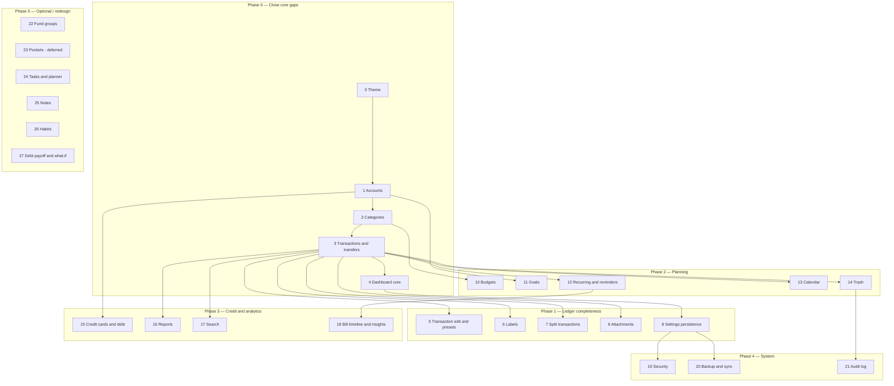

# Features Integration — Kaizen → Finance App

This is the **1-by-1 integration playbook** for recreating the legacy Kaizen Finance app (`kaizen-finance-app`) inside the refactored Finance app (`finance-app`).

It **supersedes** [`KAIZEN_FEATURE_ROADMAP.md`](./KAIZEN_FEATURE_ROADMAP.md) for implementation decisions. The older roadmap is useful history, but several of its table recommendations are already outdated (especially transfers).

---

## How to use this document

Integrate **one feature at a time**. For every feature below:

1. Recreate the **user-facing UX** (layout, flows, labels, empty states).
2. **Do not paste** Kaizen screens, repositories, or schema files.
3. Implement against **this app's architecture** in [`AGENTS.md`](./AGENTS.md).
4. Reassess tables and logic using the verdict in that feature section before writing a migration.

Architecture that must stay true:

```text
Mutations:  Route → Screen → Hook → Service → Repository → Drizzle → SQLite
Queries:    Route → Screen → Hook → Repository → Drizzle → SQLite
```

- Routes stay thin (`src/app/*.tsx`).
- Other modules import only from `@/modules/<feature>`.
- Screens never call Drizzle/SQLite.
- Multi-row writes use `db.transaction(...)` in a service.
- Money is integer minor units. Dates are Unix `timestamp_ms`.
- UI colors come from semantic / categorical theme tokens, not stored hex defaults.

---

## Global rules (apply to every feature)

| Concern | Legacy Kaizen | Finance app rule |
| :--- | :--- | :--- |
| Money | Integer cents, but UI often does float math | Persist **signed integers** in minor units. Format only in UI. |
| Dates | Split `date` + `time` TEXT | One `occurred_at` / `*_at` integer (`timestamp_ms`) |
| Colors | Raw `#RRGGBB` defaults in schema | Store **categorical keys** (`blue`, `emerald`). Resolve via theme. |
| Icons | Free-text Lucide names with DB defaults | Store icon **keys**. Resolve via `icon-library`. |
| Soft delete | Mix of `deleted_at` TEXT and `status = 'trash'` | Do not add `deleted_at` to every table. Archive flags now; dedicated trash later. |
| Sync metadata | `device_id` + `sync_version` on domain rows | Keep domain tables clean. Sync belongs in `src/infrastructure/sync/` later. |
| Pockets | Child envelopes on almost every FK | **Do not port pockets** into the core ledger. See Feature 16. |
| Transfers | One row + `from_*` / `to_*` / `transfer_pair_id` | **Keep dual-leg + `transaction_group_id`** (already live). |
| Module boundaries | Deep imports, 2k-line modals | Split UI. Public `index.ts` only. One service per write use case. |
| State | SQLite + Zustand + React Query + local state | SQLite is runtime truth. Hooks reload after mutations. |

### Cross-cutting discard list

Do **not** recreate these as first-class schema:

| Legacy object | Verdict | Why |
| :--- | :--- | :--- |
| `pockets` | Discard from core | Forced `account_id` + `pocket_id` pairs onto transactions, budgets, goals, settings, fund groups, and tasks. Envelope behavior can return later as an optional module, not as a ledger primitive. |
| `account_groups` table | Discard | Group is already an enum on `account_types.account_group` (`asset` \| `liability`). |
| `ledgers` | Discard | Seeded and backed up in Kaizen; no UI and no FK from transactions. |
| `from_account_id` / `to_account_id` / `transfer_pair_id` | Discard | Replaced by two signed legs sharing `transaction_group_id`. |
| Hex / icon defaults on tables | Discard | Presentation, not data. |
| `device_id`, `sync_version`, `sync_status` on domain tables | Discard | Sync outbox comes later, isolated. |
| Per-table `deleted_at` TEXT | Discard | Breaks FK restore. Use archive now; trash log later. |

---

## Current baseline (do not rebuild)

These already exist in `finance-app` and are the foundation later features must extend.

| Area | Status | Notes |
| :--- | :--- | :--- |
| Theme presets + switcher | Done | 6 palettes. In-memory only — persist in Feature 19. |
| Accounts + account types | Done | Lean `accounts` + `account_types`. Live CRUD, archive, reorder. |
| Categories + subcategories | Done | Self-referential `parent_id`. System categories protected. |
| Transactions list / create / delete | Mostly done | Income, expense, dual-leg transfer. **Income/expense edit is missing.** Transfer edit service exists but UI is not wired. |
| Dashboard (core cards) | Partial | Net worth, monthly cash flow, category spend, recent activity, quick actions. No widget registry yet. Aggregates are JS loops — move to SQL when reports land. |
| Settings screen | Partial | Theme switcher only. `settings` table exists but is unused. |
| SQLite Monitor | Done | Dev table browser / SQL console. |
| Sync engine | Not started | `SyncStatusChip` is decorative. No `src/infrastructure/sync/`. |

Current tables:

- `account_types`
- `accounts`
- `categories`
- `transactions` (includes `transaction_group_id`)
- `settings` (unused by app code)

Current routes: `/`, `/accounts`, `/transactions`, `/categories`, `/settings`, `/monitor`.

---

## Integration sequence



Work **top to bottom**. Do not start Phase 5 objects until the ledger, budgets, and credit-card extension tables are stable.

---

## Feature 0 — Theme presets and switcher

**Status:** Done (persist later in Feature 19)

**Kaizen source:** `themeStore`, `theme.ts`, Settings appearance section

**UX to recreate:** Six palettes (Kaizen Light, Kaizen Emerald, Cyber Azure, Amethyst Glow, Sunset Amber, Crimson Obsidian). Settings cards with dual swatches. Instant restyle.

**Do not copy:** `Object.assign` mutation of a global colors object. Kaizen required remounts / restarts for some screens.

**Finance-app mapping:**

| Layer | Path |
| :--- | :--- |
| Constants | `src/constants/theme/presets.ts` |
| Provider | `src/components/theme/app-theme-provider.tsx` |
| Hooks | `useAppTheme`, `useThemeStyles`, `useThemeController` |
| UI | `src/modules/settings/screens/settings-screen.tsx` |

**Tables:** None. Presets are typed constants.

**Logic reassessment:** Theme is presentation. Persistence belongs in `settings` (`theme_preset_id`) when Settings is wired. Do not create a `theme_colors` table for presets. A user palette table is only justified if custom swatches become a product requirement.

---

## Feature 1 — Accounts management

**Status:** Done — keep extending, do not rebuild

**Kaizen source:** `AccountsScreen`, `AccountModal`, `AccountTypesManageModal`, `accountRepository`

**UX to recreate (already largely present):** Asset / liability sections, type badges, opening balance, archive, reorder, type manager.

**Do not copy:** The 30+ column `accounts` god-table. Credit-card, loan, pocket, favorite, hide-from-reports, and sync columns on every cash account.

### Table reassessment

#### `account_groups` (Kaizen)

| Verdict | Discard |
| :--- | :--- |
| Replacement | `account_types.account_group` CHECK (`asset` \| `liability`) |

#### `account_types`

| Column | Verdict | Notes |
| :--- | :--- | :--- |
| `id`, `name`, `is_system`, `is_archived`, `sort_order` | Keep | Already in finance-app |
| `group_id` → `account_groups` | Change | Became `account_group` enum |
| `icon`, `color` hex | Change | `icon_key` + categorical `color` |
| `created_at`, `updated_at` TEXT | Change | `timestamp_ms` |

#### `accounts`

| Column | Verdict | Notes |
| :--- | :--- | :--- |
| `id`, `name`, `is_archived`, `sort_order` | Keep | |
| `account_type` free text | Change | `account_type_id` FK restrict |
| `currency` | Keep as `currency_code` | Create still forces `PHP` |
| `initial_balance` | Keep as `opening_balance_minor_units` | Integer |
| `opening_date` TEXT | Change | `opening_balance_at` timestamp |
| `credit_limit`, `statement_balance`, `minimum_payment`, `payment_due_day`, `statement_day`, `interest_rate` | Move | Feature 15 `credit_card_details` |
| `principal_amount`, `loan_term_months`, `loan_start_date` | Move | Future `loan_details` with Feature 15 / 27 |
| `pockets_enabled` | Discard | Feature 23 |
| `icon`, `color` on account | Discard | Come from account type |
| `is_favorite`, `hide_from_selection`, `hide_from_reports`, `description`, `maintaining_balance`, `is_balance_locked` | Defer | Add only if a real UX needs them. Prefer computed filters over more flags. |
| `archived_at`, `deleted_at` | Discard | `is_archived` is enough until trash |
| `device_id`, `sync_version` | Discard | |

**Live finance-app table (do not widen for Feature 15 fields):**

`id`, `account_type_id`, `name`, `currency_code`, `opening_balance_minor_units`, `opening_balance_at`, `is_archived`, `sort_order`, `created_at`, `updated_at`

### Logic reassessment

| Kaizen logic | Verdict |
| :--- | :--- |
| Balance = `initial_balance` + transaction sum | Keep. Already used. |
| Credit-card / loan fields on create | Reject. Type-specific extension tables. |
| Balance lock | Defer. If needed, a service rule — not a schema flag on day one. |
| Delete type while accounts exist | Keep current rule: reassign to group fallback; block delete of last system type. |

**Remaining work:** None required to start Feature 3 gaps. Optional later: favorite, hide-from-picker.

---

## Feature 2 — Categories

**Status:** Done — keep extending

**Kaizen source:** `CategoriesScreen`, `CategoryGroupModal`, `SubcategoryModal`

**UX to recreate (already present):** Income / expense tabs, groups + children, icon/color, reorder, A–Z sort, protected system categories, delete with reassignment.

**Do not copy:** Hex defaults (`#F0A020`), archive + delete overlapping, missing reassignment in some delete paths.

### Table reassessment

| Column | Verdict | Notes |
| :--- | :--- | :--- |
| `id`, `name`, `type` | Keep | `income` \| `expense` |
| `parent_id` | Keep | Already added |
| `icon`, `color` | Keep as keys | Not hex |
| `is_system`, `sort_order` | Keep | |
| `is_archived` | Defer | Trash / archive can wait. Delete + reassign is enough. |

**Live table:** `id`, `name`, `type`, `parent_id`, `color`, `icon`, `is_system`, `sort_order`, `created_at`, `updated_at`

### Logic reassessment

| Kaizen logic | Verdict |
| :--- | :--- |
| Parent = group, child = subcategory | Keep |
| System categories undeletable | Keep |
| Delete reassigns transactions | Keep (`cat_exp_others` / `cat_inc_others`) |
| Orphaned `category-form-modal` / `category-row` | Cleanup when touching the module — do not revive unused components |

**Remaining work:** Optional usage counts on the list. No schema change.

---

## Feature 3 — Transaction ledger and transfers

**Status:** Partial — create / list / delete live; income/expense **edit missing**

**Kaizen source:** `TransactionModal` (~2000 lines), `transactionRepository`, `SearchScreen`

**UX to recreate:** Type toggle (expense / income / transfer), account pickers, category picker, payee, note, date-time, list with search/filter/sort, detail sheet, duplicate, delete.

**Do not copy:** The monolith modal. Six nullable account/pocket FKs. `date` + `time` strings. Dual transfer models (`from/to` **and** `transfer_pair_id`).

### Table reassessment

#### Kaizen `transactions` — drop / replace

| Legacy column | Verdict |
| :--- | :--- |
| `id`, `type`, `name`, `note` | Keep |
| `amount` unsigned + type flag | Change → signed `amount_cents` |
| `account_id`, `pocket_id`, `from_*`, `to_*`, `transfer_pair_id` | Replace → one `account_id` per **leg** |
| `date`, `time` | Replace → `occurred_at` |
| `category_id` | Keep nullable (required for income/expense, null on transfer legs) |
| `is_split` | Defer to Feature 7 (`transaction_entries`) |
| `recurring_template_id` | Add in Feature 12 |
| `status` (`active` / `pending` / `cleared` / `trash`) | Defer. Add `status` only when pending/cleared is a real filter. Trash is Feature 14. |
| `currency`, `exchange_rate`, `amount_in_primary` | Defer until multi-currency is a product goal |
| `device_id`, `sync_*`, `deleted_at` | Discard |

#### Live `transactions` (keep)

| Column | Role |
| :--- | :--- |
| `account_id` | The account this **leg** affects |
| `category_id` | Income/expense only |
| `transaction_group_id` | Shared id for transfer legs (and later splits / CC payment groups if needed) |
| `type` | `income` \| `expense` \| `transfer` |
| `amount_cents` | Signed integer. Expense/out-leg negative. Income/in-leg positive. |
| `name`, `note` | Optional |
| `occurred_at` | Single timestamp |

### Logic reassessment

| Operation | Kaizen | Finance app (keep) |
| :--- | :--- | :--- |
| Transfer write | One row with from/to | **Two rows**, same `transaction_group_id`, opposite signs, `db.transaction` |
| Transfer read | Filter `type = transfer` | Repository **groups** legs into one list item (`groupTransferRows`) |
| Transfer delete | Delete one row | Delete **entire group** |
| Same-account transfer | Used for pocket moves | **Reject** (`Cannot transfer funds to the same account`) |
| Balance | Sum signed amounts | Keep. Opening balance + sum(`amount_cents`) per account |
| Category on transfer | Sometimes set | Always `null` on both legs |

**Roadmap correction:** Do **not** go back to a single-row transfer with `transfer_account_id`. Migration `0005` already removed that column.

### Architecture to use

| Layer | Path |
| :--- | :--- |
| Screen | `src/modules/transactions/screens/transactions-screen.tsx` |
| Components | form / detail / filter / row (keep split; do not merge into one modal) |
| Hook | `use-transactions.ts` |
| Services | `create-transaction`, `create-transfer`, `update-transfer`, `delete-transaction` |
| Missing service | `update-transaction.service.ts` |
| Missing schema | `src/modules/transactions/schemas/transaction.schema.ts` (Zod) |
| Repository | `transactions.repository.ts` (single file is fine while concise) |

**Remaining work (do this before Feature 5 extras):**

1. Add `update-transaction.service.ts` (income/expense only; transfers stay on `update-transfer`).
2. Wire edit from the detail modal.
3. Add Zod schemas.
4. Keep CSV export stubbed until Feature 17 / 20.

---

## Feature 4 — Dashboard (core)

**Status:** Partial

**Kaizen source:** `DashboardScreen`, `dashboardWidgetRegistry` (10 widgets)

**UX to recreate now:** Net worth hero, asset vs liability, monthly income/expense, top categories, recent activity, FAB / quick actions.

**UX to defer:** Configurable widget grid, Safe-to-Spend, cash runway, health score, no-spend streak, habit challenges, insights cards, today's tasks. Those depend on later modules.

**Do not copy:** Loading every row into JS on each render. Zustand-driven full-DB polls. Widget registry that assumes tasks/habits exist.

### Table reassessment

No new domain table for core cards.

Optional later (Feature 4b, after Settings):

```text
dashboard_widget_prefs
  widget_id TEXT PK
  enabled INTEGER NOT NULL
  sort_order INTEGER NOT NULL
  updated_at INTEGER NOT NULL
```

Do not create this until at least 5 real widgets exist.

### Logic reassessment

| Kaizen | Verdict |
| :--- | :--- |
| Net worth in JS from all accounts | Keep formula; **change** implementation to SQL `SUM` grouped by account/group |
| Transfers counted as income/expense | Reject. Core dashboard already skips grouped transfer legs for cash flow — keep that rule |
| Locked widgets (`net_worth`, `recent_activity`) | Keep the idea when prefs exist |
| Tasks / habits / insights widgets | Blocked on Features 24, 26, 18 |

**Remaining work:** Loading / error state on `DashboardScreen`. SQL aggregates when Feature 16 lands. Do not port the full Kaizen widget list yet.

---

## Feature 5 — Transaction edit, duplicate, presets

**Status:** Not started (duplicate exists; edit income/expense does not)

**Kaizen source:** `TransactionPresetsModal`, `transaction_presets`, duplicate action

**UX to recreate:** Edit existing income/expense. Duplicate pre-fills the form. Optional later: named presets (amount + account + category + type).

### Table reassessment

`transaction_presets` — **defer**. Presets are a convenience cache of form defaults. Duplicate + last-used suggestions cover 80% without a table.

If added later:

```text
transaction_presets
  id TEXT PK
  name TEXT NOT NULL
  type TEXT NOT NULL            -- income | expense | transfer
  amount_cents INTEGER NOT NULL -- unsigned magnitude
  account_id TEXT NULL FK
  transfer_account_id TEXT NULL FK   -- transfer destination only
  category_id TEXT NULL FK
  note TEXT
  icon_key TEXT
  color TEXT                    -- categorical
  sort_order INTEGER NOT NULL
  created_at INTEGER NOT NULL
  updated_at INTEGER NOT NULL
```

No `pocket_id`. No hex defaults.

### Logic reassessment

| Item | Verdict |
| :--- | :--- |
| Duplicate | Keep as UI + create service (already possible) |
| Edit income/expense | New service; optimistic concurrency not needed |
| Edit transfer | Service exists — wire UI |
| Preset "frequently used" | Prefer query of recent transactions over a second table |

---

## Feature 6 — Labels and tags

**Status:** Not started

**Kaizen source:** `LabelsScreen`, `labels`, `transaction_labels`

**UX to recreate:** CRUD labels, assign many labels per transaction, filter the ledger by label.

**Do not copy:** Cascade deletes without an index on `label_id` (Kaizen locked SQLite).

### Table reassessment

```text
labels
  id TEXT PK
  name TEXT NOT NULL UNIQUE
  color TEXT                    -- categorical key, nullable
  icon_key TEXT
  created_at INTEGER NOT NULL
  updated_at INTEGER NOT NULL

transaction_labels
  transaction_id TEXT NOT NULL FK → transactions.id ON DELETE CASCADE
  label_id TEXT NOT NULL FK → labels.id ON DELETE CASCADE
  PRIMARY KEY (transaction_id, label_id)
  INDEX (label_id)
```

**Drop vs Kaizen:** `is_archived` (delete is enough until trash). No icon hex.

### Logic reassessment

| Item | Verdict |
| :--- | :--- |
| Labels on both transfer legs | Apply to **both legs** in the same `db.transaction`, or store on the group via the out-leg only and hydrate in the repository. Prefer writing both legs so filters stay simple. |
| Delete label | Cascade join rows; do not touch transactions |
| Filter | Query flow: hook → repository join. No service. |

**Architecture:** `src/modules/labels/` with screen, hook, `create-label` / `delete-label` services, `labels.repository.ts`. Transactions module imports labels only through `@/modules/labels`.

---

## Feature 7 — Split transactions

**Status:** Not started

**Kaizen source:** `transaction_entries`, `is_split` on parent

**UX to recreate:** One payment, several category lines (e.g. groceries + household). Child amounts must equal parent.

**Do not copy:** Duplicate parent rows. Missing sum validation.

### Table reassessment

```text
transaction_entries
  id TEXT PK
  transaction_id TEXT NOT NULL FK → transactions.id ON DELETE CASCADE
  category_id TEXT NOT NULL FK → categories.id ON DELETE RESTRICT
  amount_cents INTEGER NOT NULL   -- same sign as parent, or always positive + inherit parent type
  note TEXT
  created_at INTEGER NOT NULL
  updated_at INTEGER NOT NULL
```

Add to `transactions` only if needed:

- `is_split INTEGER NOT NULL DEFAULT 0` — optional denormalization for list badges. Can also be derived (`EXISTS entries`). Prefer **derived** first.

**Do not** put split lines on transfer legs.

### Logic reassessment

| Rule | Verdict |
| :--- | :--- |
| `sum(abs(entries)) === abs(parent.amount_cents)` | Enforce in `create-split-transaction.service` / update service inside `db.transaction` |
| Parent `category_id` | Null when split; category lives on entries |
| Reports / budgets | Sum **entries** when present, else parent |
| Delete parent | Cascade entries |

---

## Feature 8 — Receipt attachments

**Status:** Not started

**Kaizen source:** `attachments`, `attachmentRepository`, image/document picker

**UX to recreate:** Attach photo/file to a transaction. Open / delete attachment.

### Table reassessment

```text
attachments
  id TEXT PK
  transaction_id TEXT NOT NULL FK → transactions.id ON DELETE CASCADE
  file_name TEXT NOT NULL
  local_uri TEXT NOT NULL
  mime_type TEXT
  byte_size INTEGER
  created_at INTEGER NOT NULL
```

**Drop vs Kaizen:** `drive_file_id`, `uploaded_at` until Feature 20. Those belong to the sync adapter, not the attachment row's first version.

### Logic reassessment

- Files live on device. SQLite stores metadata only.
- For transfers, attach to **both legs** or to the group via one canonical leg (out-leg). Pick one rule and document it in the service.
- Delete transaction deletes files in the service after the DB transaction succeeds (best-effort FS cleanup).

---

## Feature 9 — Settings persistence

**Status:** Not started (table exists)

**Kaizen source:** `settings` key-value, `useSettings`, many untyped keys

**UX to recreate:** Default currency, default income/expense accounts, start of week/month, date format, larger text, high contrast, developer mode.

**Do not copy:** Untyped strings with mixed `'1'` / `'true'`. Pocket default keys. Theme hex CRUD as a substitute for presets.

### Table reassessment

Keep the existing table:

```text
settings
  key TEXT PK
  value TEXT NOT NULL
  updated_at INTEGER NOT NULL
```

Do **not** explode this into one column-per-setting.

Typed access lives in `src/modules/settings/`:

- `settings.repository.ts` — get/set
- `settings.schema.ts` — Zod parse per key
- `use-settings.ts` — query hook
- `update-setting.service.ts` — mutation

### Keys to adopt (v1)

| Key | Value |
| :--- | :--- |
| `theme_preset_id` | `kaizenLight` \| … |
| `font_scale` | `normal` \| `large` |
| `high_contrast` | `true` \| `false` |
| `default_currency` | `PHP` |
| `default_income_account_id` | account id |
| `default_expense_account_id` | account id |
| `start_day_of_week` | `0`–`6` |
| `developer_mode` | `true` \| `false` |

**Drop vs Kaizen:** `default_*_pocket_id`, `cc_payment_source_pocket_id`, `security_pin` (Feature 19 uses SecureStore, not this table).

---

## Feature 10 — Budgets

**Status:** Not started

**Kaizen source:** `BudgetsScreen`, `budgets`, `budget_items`

**UX to recreate:** Monthly category limits, progress, remaining, month switcher, optional rollover.

**Do not copy:** Budget items scoped to fund group **and** account **and** pocket. `toISOString().slice(0,7)` month keys (timezone drift).

### Table reassessment

```text
budgets
  id TEXT PK
  name TEXT NOT NULL
  period TEXT NOT NULL              -- 'monthly' first
  period_start_day INTEGER NOT NULL DEFAULT 1
  start_at INTEGER NOT NULL         -- timestamp_ms
  end_at INTEGER                    -- nullable = open
  rollover_enabled INTEGER NOT NULL DEFAULT 0
  is_active INTEGER NOT NULL DEFAULT 1
  created_at INTEGER NOT NULL
  updated_at INTEGER NOT NULL

budget_items
  id TEXT PK
  budget_id TEXT NOT NULL FK CASCADE
  category_id TEXT NOT NULL FK RESTRICT
  limit_cents INTEGER NOT NULL      -- unsigned limit
  created_at INTEGER NOT NULL
  updated_at INTEGER NOT NULL
  UNIQUE (budget_id, category_id)
```

**Drop vs Kaizen (v1):** `fund_group_id`, `account_id`, `pocket_id` on items. Category-level budgets first. Account-scoped budgets can wait until a user actually needs them.

### Logic reassessment

| Item | Verdict |
| :--- | :--- |
| Spent | Sum expense `amount_cents` (or split entries) in `[start_at, end_at)` for that category |
| Rollover | Service computes leftover at period close; do not store a running balance column |
| Over budget | Derived in repository / insights, not a table flag |
| Transfers | Never count toward spent |

**Architecture:** `src/modules/budgets/` — screen, hook, `save-budget.service`, `budget.repository`, Zod schema. Thin route `src/app/budgets.tsx`.

---

## Feature 11 — Goals

**Status:** Not started

**Kaizen source:** `GoalsScreen`, goals linked to account **or pocket**

**UX to recreate:** Name, target amount, target date, linked account, progress, mark complete.

**Do not copy:** Pocket-based progress. Hex/icon defaults in schema.

### Table reassessment

```text
goals
  id TEXT PK
  name TEXT NOT NULL
  target_amount_cents INTEGER NOT NULL
  account_id TEXT NULL FK → accounts.id
  target_at INTEGER                 -- timestamp_ms, nullable
  icon_key TEXT
  color TEXT                        -- categorical
  is_completed INTEGER NOT NULL DEFAULT 0
  completed_at INTEGER
  created_at INTEGER NOT NULL
  updated_at INTEGER NOT NULL
```

Progress is **not stored**. It is `current account balance` (or contributions later).

If contributions need to be tracked independently of account balance, add later:

```text
goal_contributions
  id, goal_id, transaction_id NULL, amount_cents, occurred_at
```

Do not add this until a goal can exist without a dedicated account.

### Logic reassessment

| Item | Verdict |
| :--- | :--- |
| Progress = pocket balance | Reject |
| Progress = linked account balance | Accept for v1 |
| Milestones 25/50/75/100 | Derived in the hook, not extra rows |
| Complete flag | Service sets `is_completed` + `completed_at` |

---

## Feature 12 — Recurring transactions and reminders

**Status:** Not started

**Kaizen source:** `recurring_templates`, `RecurringModal`, `RemindersScreen`

**UX to recreate:** Templates for expense / income / transfer. Frequency, next due, post now, skip, optional auto-post, notify N days before.

**Do not copy:** Duplicate posting when the app opens twice on the due day. `from_*` / `to_*` / pocket columns. Creating tasks automatically (Feature 24).

### Table reassessment

```text
recurring_templates
  id TEXT PK
  name TEXT NOT NULL
  type TEXT NOT NULL                -- income | expense | transfer
  amount_cents INTEGER NOT NULL     -- unsigned magnitude
  account_id TEXT NOT NULL FK
  transfer_account_id TEXT NULL FK  -- required when type = transfer
  category_id TEXT NULL FK
  note TEXT
  frequency TEXT NOT NULL           -- daily | weekly | monthly | yearly
  interval INTEGER NOT NULL DEFAULT 1
  day_of_month INTEGER
  day_of_week INTEGER
  start_at INTEGER NOT NULL
  end_at INTEGER
  end_type TEXT NOT NULL DEFAULT 'never'  -- never | date | count
  end_after_count INTEGER
  weekend_rule TEXT NOT NULL DEFAULT 'none'
  next_run_at INTEGER NOT NULL
  last_run_at INTEGER
  auto_post INTEGER NOT NULL DEFAULT 0
  notify_days_before INTEGER NOT NULL DEFAULT 1
  is_active INTEGER NOT NULL DEFAULT 1
  snoozed_until INTEGER
  created_at INTEGER NOT NULL
  updated_at INTEGER NOT NULL
```

Index: `recurring_templates_next_run_at_index` on (`is_active`, `next_run_at`).

Posted transactions get `recurring_template_id` (add nullable FK on `transactions` in this feature's migration).

### Logic reassessment

| Item | Verdict |
| :--- | :--- |
| Auto-post | `process-due-recurring.service.ts` inside `db.transaction` |
| Idempotency | Compare `last_run_at` / occurrence key before insert. Never post twice for the same `next_run_at`. |
| Transfer template | Call `createTransfer`, then stamp both legs with `recurring_template_id` |
| Reminders UI | Same module (`src/modules/recurring/`). Do not split "reminders" vs "recurring" into two modules unless the UI really diverges. |
| Snooze / skip | Update `next_run_at` only — do not insert a transaction |

---

## Feature 13 — Calendar

**Status:** Not started

**Kaizen source:** `CalendarScreen` (month grid + day list + tasks)

**UX to recreate:** Month grid, income/expense dots, tap day → that day's transactions and net change. FAB for that date.

**Do not copy:** 31 queries (`WHERE date = 'YYYY-MM-DD'`). Tasks on the calendar (Feature 24).

### Table reassessment

No new table.

### Logic reassessment

One range query:

```text
WHERE occurred_at >= startOfMonth AND occurred_at < startOfNextMonth
```

Aggregate in the repository (`count` / `sum` by local day). Convert `timestamp_ms` → local calendar day in one place (`src/utils/date.ts`), never with `toISOString().slice`.

**Architecture:** `src/modules/calendar/` — screen, hook, repository read. Reuse `@/modules/transactions` for create.

---

## Feature 14 — Trash and restore

**Status:** Not started

**Kaizen source:** `TrashScreen`, mix of `deleted_at` and `status = 'trash'`

**UX to recreate:** Soft-remove transactions (and later accounts). Restore or purge. Empty trash.

**Do not copy:** Restoring a transaction whose account is gone (FK crash). `deleted_at` on every entity.

### Table reassessment

Prefer **one trash log** plus a status on transactions:

```text
-- Option A (recommended for transactions first)
transactions.status TEXT NOT NULL DEFAULT 'active'
  -- 'active' | 'trashed'
INDEX transactions_status_occurred_at (status, occurred_at)

-- Option B (later, multi-entity)
trash_items
  id TEXT PK
  entity_type TEXT NOT NULL     -- transaction | account | category | ...
  entity_id TEXT NOT NULL
  payload TEXT NOT NULL         -- JSON snapshot for purge/restore
  trashed_at INTEGER NOT NULL
```

Start with **Option A on transactions only**. Accounts already have `is_archived`. Do not treat archive as trash.

### Logic reassessment

| Item | Verdict |
| :--- | :--- |
| Trash transfer | Set both legs to `trashed` in one transaction |
| Restore | Service checks account + category still exist |
| Purge | Hard delete group + entries + labels + attachments |
| Default lists | All read repositories add `status = 'active'` |

---

## Feature 15 — Credit cards and debt

**Status:** Not started

**Kaizen source:** Credit fields on `accounts`, `credit_card_charges`, installment tables, `CreditCardMonitoringScreen`

**UX to recreate:** Limit, utilization, statement day, due day, unbilled / billed / paid charges, mark paid (creates a transfer from a funding account).

**Do not copy:** Putting limit / APR / due day on every account. Auto-creating charges inside the giant transaction modal.

### Table reassessment

```text
credit_card_details
  account_id TEXT PK FK → accounts.id ON DELETE CASCADE
  credit_limit_cents INTEGER NOT NULL
  statement_day INTEGER NOT NULL        -- 1-31
  due_day INTEGER NOT NULL
  interest_rate_basis_points INTEGER    -- 1250 = 12.50%
  minimum_payment_cents INTEGER
  created_at INTEGER NOT NULL
  updated_at INTEGER NOT NULL

credit_card_charges
  id TEXT PK
  transaction_id TEXT NOT NULL FK → transactions.id
  account_id TEXT NOT NULL FK → accounts.id
  amount_cents INTEGER NOT NULL
  purchased_at INTEGER NOT NULL
  billed_at INTEGER
  due_at INTEGER
  payment_type TEXT NOT NULL            -- full | installment
  status TEXT NOT NULL DEFAULT 'open'   -- open | billed | paid | overdue
  installment_plan_id TEXT
  created_at INTEGER NOT NULL
  updated_at INTEGER NOT NULL

installment_plans
  id TEXT PK
  charge_id TEXT NOT NULL FK
  total_cents INTEGER NOT NULL
  installment_count INTEGER NOT NULL
  installment_cents INTEGER NOT NULL
  interest_rate_basis_points INTEGER NOT NULL DEFAULT 0
  created_at INTEGER NOT NULL

installment_schedule_items
  id TEXT PK
  plan_id TEXT NOT NULL FK
  sequence INTEGER NOT NULL
  amount_cents INTEGER NOT NULL
  billed_at INTEGER NOT NULL
  due_at INTEGER
  status TEXT NOT NULL DEFAULT 'unbilled'
  created_at INTEGER NOT NULL
```

`statement_balance` is **not stored**. Derive from open charges.

Loan-only fields from Kaizen (`principal_amount`, `loan_term_months`, `loan_start_date`) wait for a `loan_details` table if/when Feature 27 needs them. Do not add them to `accounts`.

### Logic reassessment

| Item | Verdict |
| :--- | :--- |
| Detect CC account | `account_types` system id `system:liability:credit-card` **or** presence of `credit_card_details` |
| Expense on CC | `create-transaction.service` stays generic. A **credit-card module service** (`record-credit-card-charge.service`) wraps it and inserts the charge row. Do not hide this inside the transactions UI component. |
| Mark paid | Create a transfer (funding account → CC account) via `createTransfer`, then mark charge `paid` in the same DB transaction |
| Payment source | Settings key `cc_payment_source_account_id` |
| Reminders | Optional `recurring_template_id` on charges **after** Feature 12. Do not create a circular write from charges → templates in v1. |

**Architecture:** `src/modules/credit-card/` — never put CC SQL in `transactions.repository.ts`.

---

## Feature 16 — Reports and cash flow

**Status:** Not started

**Kaizen source:** `ReportsScreen`, charts, PDF export

**UX to recreate:** Range picker, totals, savings rate, category donut, cash-flow trend, top categories, share/PDF later.

**Do not copy:** Pulling every transaction into memory to chart.

### Table reassessment

No new tables. Add indexes if missing:

- `transactions (occurred_at, type)`
- `transactions (category_id, occurred_at)` (already exists)

### Logic reassessment

All figures are repository SQL (`SUM`, `GROUP BY` month / category). Transfers excluded from income/expense. PDF export is a pure function over DTO data in `src/modules/reports/utils/`, not a repository.

**Architecture:** `src/modules/reports/` — query-only (no services unless export writes a file with validation).

---

## Feature 17 — Global search and advanced filters

**Status:** Partial (client-side search on the transactions screen)

**Kaizen source:** `SearchScreen`, `searchRepository`

**UX to recreate:** Full-ledger search, filters (range, type, accounts, categories, labels, amount), sort, CSV of the current result set.

### Table reassessment

v1: filter in SQL with `LIKE` / indexed columns. **No FTS5 yet.**

v2 (only if search feels slow):

```text
-- FTS5 virtual table + triggers on transactions name/note
```

Do not add FTS5 in the same PR as labels/filters.

### Logic reassessment

Move filter execution from the screen into `transactions.repository` (or `search.repository` inside the transactions module). CSV is a Feature 20-adjacent export utility, not a second screen unless the filter UI outgrows the ledger.

---

## Feature 18 — Bill timeline and insights

**Status:** Not started  
**Depends on:** Feature 12 (and Feature 15 for CC due dates)

**Kaizen source:** `BillTimelineScreen`, `insightsEngine.ts`

**UX to recreate:** 90-day upcoming bills. Insight cards (velocity, month-over-month, savings rate).

### Table reassessment

No dedicated insights table. Insights are **pure functions** over repository DTOs (`src/modules/insights/`).

Optional later: `notifications` for scheduled local alerts.

```text
notifications
  id TEXT PK
  type TEXT NOT NULL
  title TEXT NOT NULL
  body TEXT NOT NULL
  recurring_template_id TEXT
  budget_id TEXT
  goal_id TEXT
  scheduled_at INTEGER NOT NULL
  delivered_at INTEGER
  is_dismissed INTEGER NOT NULL DEFAULT 0
  created_at INTEGER NOT NULL
```

Do not create `notifications` until OS push/local notifications are actually wired.

### Logic reassessment

Port **formulas**, not the file. Keep the engine free of React and Drizzle. Dashboard widgets call the engine through an insights hook.

---

## Feature 19 — App lock and privacy

**Status:** Not started

**Kaizen source:** PIN, biometric, `privacyStore`, `PrivacyScreenOverlay`

**UX to recreate:** 4-digit PIN, optional biometric, privacy mask on amounts, blur in app switcher.

### Table reassessment

**Do not store the PIN in `settings`.** Use `expo-secure-store`.

Settings keys only:

- `pin_lock_enabled`
- `biometric_lock_enabled`
- `privacy_mask_enabled`

### Logic reassessment

`src/modules/security/` — gate in root layout, not in each screen. Amount masking stays in `FormattedCurrency` / theme-aware display. No schema for privacy.

---

## Feature 20 — Backup and remote sync

**Status:** Not started

**Kaizen source:** JSON/CSV backup, Google Drive, `sync_queue`, `balance_cache`

**UX to recreate:** Export JSON, restore JSON, export CSV, later Drive. UI never waits on the network.

**Do not copy:** Restoring Kaizen's JSON shape 1:1. `balance_cache` as a second source of truth.

### Table reassessment

When sync starts, create isolated tables under `src/infrastructure/database/schema/sync.ts`:

```text
sync_outbox
  id TEXT PK
  entity_type TEXT NOT NULL
  entity_id TEXT NOT NULL
  operation TEXT NOT NULL          -- insert | update | delete
  payload TEXT NOT NULL
  created_at INTEGER NOT NULL
  synced_at INTEGER
  failed_at INTEGER
  retry_count INTEGER NOT NULL DEFAULT 0
```

**Discard:** `balance_cache`. Balances are always computed.

Backup JSON is a **versioned export DTO**, not a dump of Drizzle rows. Restore goes through services so invariants (transfer pairs, split sums, opening balances) stay valid.

**Architecture:** `src/infrastructure/sync/` for outbox/engine. `src/modules/backup/` for user-facing export/import UI.

---

## Feature 21 — Audit log

**Status:** Not started

**Kaizen source:** `audit_log`, `AuditLogScreen`

**UX to recreate:** Read-only list of destructive / archive / restore / wipe actions.

### Table reassessment

```text
audit_log
  id TEXT PK
  entity_type TEXT NOT NULL
  entity_id TEXT
  action TEXT NOT NULL
  summary TEXT NOT NULL
  created_at INTEGER NOT NULL
INDEX audit_log_created_at (created_at)
```

No FK to domain rows (entities may be purged).

### Logic reassessment

Services that archive, trash, purge, or wipe write an audit row in the **same** `db.transaction`. No audit writes from UI.

---

## Feature 22 — Fund groups (optional)

**Status:** Not started — **optional after Feature 10 / 16**

**Kaizen source:** `fund_groups`, `fund_group_members`, `FundGroupsScreen`

**UX to recreate:** Named groups of accounts for a report/budget lens (e.g. Personal vs Business).

**Do not copy:** Members that can be either an account **or** a pocket.

### Table reassessment

```text
fund_groups
  id TEXT PK
  name TEXT NOT NULL
  icon_key TEXT
  color TEXT
  sort_order INTEGER NOT NULL DEFAULT 0
  created_at INTEGER NOT NULL
  updated_at INTEGER NOT NULL

fund_group_members
  id TEXT PK
  fund_group_id TEXT NOT NULL FK CASCADE
  account_id TEXT NOT NULL FK → accounts.id
  created_at INTEGER NOT NULL
  UNIQUE (fund_group_id, account_id)
```

Skip this module if reports can filter by a list of account ids in the UI.

---

## Feature 23 — Pockets (deferred / redesign)

**Status:** Explicitly **not porting**

**Kaizen source:** `pockets`, Main pocket backfill, `PocketModal`, reallocation transfers

### Why this is deferred

Pockets leaked into every money table. They made transfers same-account, forced silent Main-pocket resolution, and blocked credit cards from using the same model.

### If envelope budgeting is needed later

Do **not** revive `pocket_id` on transactions.

Preferred redesigns (pick one when the time comes):

1. **Virtual envelopes** — `account_envelopes` + `envelope_allocations` pointing at existing transactions. Ledger stays account-level.
2. **Child accounts** — real `accounts` rows with `parent_account_id`. Transfers stay dual-leg between two account ids. Heavier, but consistent.

Until then: use multiple accounts, goals, and budgets.

---

## Feature 24 — Tasks and daily planner (optional)

**Status:** Not started — **optional, after core finance**

**Kaizen source:** `tasks`, `task_recurrences`, `PlannerScreen`, `TasksScreen`

**UX to recreate (if product still wants it):** To-dos with due dates; optional "create transaction from task".

**Do not copy:** Eight finance FKs on `tasks`. That table mixed a planner with a second ledger.

### Table reassessment (if built)

```text
tasks
  id TEXT PK
  title TEXT NOT NULL
  description TEXT
  status TEXT NOT NULL              -- todo | in_progress | completed | cancelled
  priority TEXT NOT NULL DEFAULT 'normal'
  due_at INTEGER
  completed_at INTEGER
  created_at INTEGER NOT NULL
  updated_at INTEGER NOT NULL

task_finance_links          -- optional, only if linking is required
  task_id TEXT PK FK CASCADE
  account_id TEXT
  category_id TEXT
  expected_amount_cents INTEGER
  linked_transaction_id TEXT
  transaction_type TEXT
```

Recurrence: reuse Feature 12 patterns or a small `task_recurrences` table. Do not invent a third scheduler.

### Logic reassessment

Creating a transaction from a task calls `@/modules/transactions` services, then stores `linked_transaction_id`. Tasks never insert into `transactions` themselves.

---

## Feature 25 — Notes and notebooks (optional)

**Status:** Not started — **optional**

**Kaizen source:** `notebooks`, `notes`, `NotesScreen`

This is not a finance primitive. If rebuilt:

```text
notebooks  id, name, icon_key, color, is_default, sort_order, created_at, updated_at
notes      id, notebook_id, title, content, is_pinned, linked_at, created_at, updated_at
```

`tags` as a JSON string is rejected — omit tags or use a join table. Soft delete can wait for Feature 14 patterns.

---

## Feature 26 — Habits and no-spend streak (optional)

**Status:** Not started — **optional**

**Kaizen source:** `habit_challenges`, streak computed from expenses

### Table reassessment

No table for the streak. It is: consecutive local days with **zero** `type = 'expense'` transactions.

```text
habit_challenges
  id TEXT PK
  challenge_type TEXT NOT NULL      -- e.g. no_spend
  title TEXT NOT NULL
  target_days INTEGER NOT NULL
  start_at INTEGER NOT NULL
  end_at INTEGER
  status TEXT NOT NULL              -- active | completed | failed
  created_at INTEGER NOT NULL
  updated_at INTEGER NOT NULL
```

Only add this when the dashboard widget is scheduled. The widget is presentation over `habitRepository` reads.

---

## Feature 27 — Debt payoff planner and what-if (optional)

**Status:** Not started — **optional, after Feature 15**

**Kaizen source:** `debtPayoffSimulation.ts`, `WhatIfScenarioModal`

### Table reassessment

**No simulation tables.** Simulations are pure functions in `src/modules/credit-card/utils/` (or `src/modules/accounts/utils/` for generic liabilities). Inputs: liability balances, APR from `credit_card_details` / future `loan_details`, extra payment, start date.

Do not persist scenarios until a user asks to save them. If saved later, a tiny `debt_scenarios` table is enough (`id`, `name`, `payload`, timestamps) — JSON payload, not 20 columns.

---

## Feature 28 — Demo data, wearables, home widgets

**Status:** Out of scope for integration order

| Item | Verdict |
| :--- | :--- |
| Load demo data | Useful for QA. Implement as a **service** that calls existing create services (not raw SQL inserts that bypass rules). |
| Wearable quick log | Stub in Kaizen. Skip. |
| Home screen widgets | Native bridge. Skip until the core app is stable. |

---

## Full table map (Kaizen → Finance app)

| Kaizen table | Verdict | Finance-app destination |
| :--- | :--- | :--- |
| `account_groups` | Discard | Enum on `account_types` |
| `account_types` | Keep (normalized) | `account_types` **live** |
| `accounts` | Keep (slimmed) | `accounts` **live** |
| `pockets` | Discard / redesign | Feature 23 only |
| `categories` | Keep | `categories` **live** |
| `transactions` | Keep (redesigned) | `transactions` **live** (dual-leg) |
| `transaction_entries` | Redesign | Feature 7 |
| `transaction_labels` + `labels` | Keep | Feature 6 |
| `transaction_presets` | Defer | Feature 5 |
| `attachments` | Keep (slimmed) | Feature 8 |
| `budgets` + `budget_items` | Keep (no pocket/fund FKs) | Feature 10 |
| `goals` | Keep (account only) | Feature 11 |
| `recurring_templates` | Redesign | Feature 12 |
| `fund_groups` + members | Optional | Feature 22 |
| `credit_card_charges` + installment_* | Keep as extension | Feature 15 |
| `credit_*` columns on `accounts` | Move | `credit_card_details` |
| `settings` | Keep | `settings` **live, unused** |
| `theme_colors` | Discard for now | Theme constants |
| `dashboard_widget_prefs` | Defer | Feature 4b |
| `sync_queue` | Redesign | `sync_outbox` in Feature 20 |
| `balance_cache` | Discard | Compute |
| `ledgers` | Discard | — |
| `notifications` | Defer | Feature 18 |
| `audit_log` | Keep | Feature 21 |
| `habit_challenges` | Optional | Feature 26 |
| `tasks` + `task_recurrences` | Optional / split | Feature 24 |
| `notebooks` + `notes` | Optional | Feature 25 |

---

## Shared UI to recreate (not copy)

Rebuild these in `src/components/` **only when a second module needs them**. First consumer can keep the component inside its module.

| Kaizen component | Finance-app approach |
| :--- | :--- |
| `FormBottomSheet` | Keyboard-safe sheet. New shared component when a second form needs it. |
| `AmountDisplay` | Already have `formatted-currency.tsx` — extend, don't replace with Kaizen file |
| `AmountCalculatorField` / keypad | Already have `amount-calculator-modal.tsx` |
| `DatePickerModal` | Already have `date-picker-modal.tsx` — add time on the same timestamp |
| `IconPickerModal` | Already have `icon-picker-modal.tsx` |
| `SortableListModal` | Already have `sortable-list-modal.tsx` |
| `FloatingActionButton` | Already have `floating-action-button.tsx` |
| `CustomAlertModal` | Add when native `Alert` is not enough |
| Charts | Add under `src/components/charts/` for Feature 16 only |
| `AdaptiveRow` / Larger Text | Follow kaizen-finance-app `AGENTS.md` UI rules (two font tiers, wrap/stack) without copying those components verbatim |

---

## Navigation plan

Keep Expo Router + `AppShell` (desktop sidebar / mobile drawer). Add a **thin route** when a module screen exists.

| When feature ships | Add route |
| :--- | :--- |
| Feature 10 | `src/app/budgets.tsx` |
| Feature 11 | `src/app/goals.tsx` |
| Feature 12 | `src/app/recurring.tsx` |
| Feature 13 | `src/app/calendar.tsx` |
| Feature 14 | `src/app/trash.tsx` |
| Feature 15 | `src/app/credit-cards.tsx` |
| Feature 16 | `src/app/reports.tsx` |
| Feature 18 | `src/app/bills.tsx` |
| Feature 21 | `src/app/audit.tsx` |
| Feature 6 | `src/app/labels.tsx` |
| Optional 22 / 24 / 25 | `fund-groups`, `tasks`, `notes` |

Do not add drawer items for features that are not implemented.

---

## Per-feature implementation checklist

Use this when starting any feature:

1. Read this feature's **table verdict** and write/adjust Drizzle schema under `src/infrastructure/database/schema/`.
2. Generate a migration into `drizzle/`.
3. Create `src/modules/<feature>/` with only the folders you need.
4. Public API in `index.ts`.
5. Writes: one service file per use case + Zod in `schemas/`.
6. Reads: hook → repository.
7. Thin route + sidebar entry.
8. Recreate UX from Kaizen **by inspection**, rewrite JSX against this app's theme hooks.
9. `npx tsc --noEmit`.
10. Add or extend `__tests__` for services/repositories.

---

## Recommended next step

Close the **core ledger** before any new module:

1. **Feature 3 leftover:** `update-transaction.service.ts` + Zod + wire edit in the transaction detail UI.
2. **Feature 3 leftover:** Wire `update-transfer` in the UI.
3. **Feature 9:** Persist theme + defaults through `settings`.
4. Then **Feature 6 (labels)** or **Feature 7 (splits)** — both extend the ledger without new navigation complexity.
5. Then **Feature 10 (budgets)** as the first new primary screen.

Do not start pockets, tasks, notes, or Drive sync while income/expense edit is still a stub.
